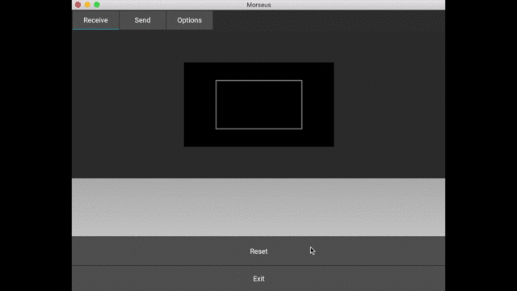

# Morseus

*Morse signals translator.*



We believe in the importance of communication, especially when you're in great
need and conventional channels are not available, but you can rely on one of
the simplest (and fastest at the same time) information carriers, *light*.
By this, we enable you the possibility of sending and receiving Morse light
signals without even knowing the code, but just having the **Morseus** app
installed on your portable device, without the need of an internet connection,
GSM or any kind of access.

With *Morseus* you can decode Morse signals sent from humans in real-time,
then talking with them in "their language" at the very same speed, all of
these by just opening the app and pointing the camera towards the light
source, even from far away. Write text, click *Start* and now you're replying
in such a way that the sender will perfectly understand your message.


## Installation

You can download prebuilt binary executables for your platform by accessing
the links below:

- Mac, Linux, Windows: https://goo.gl/BUc9kx
- iOS, Android: App/Play Store


#### Manual install

If you want to manually install the app on your supported platform, then you
need to download the repository, install the package alongside its
requirements and finally run the app's main executable script.

For this project, we're gonna use Python 2 version and closely follow the
instructions below. They are compatible with the Mac platform, but with minor
changes you can make them work on Linux or Windows too.


#### Install Python interpreter and pip:

*Mac*

```bash
$ brew update && brew install python
$ easy_install --upgrade pip
```

Make sure that you're using the correct version of pip by running
`pip --version`. It should use the Python 2 version, if not, try with
*pip2* instead.


#### Clone repository and install package:

```bash
$ git clone https://github.com/cmin764/morseus.git
$ cd morseus
$ ./setup.sh    # setup.bat on Windows (use `sudo` on Linux)
```

Note that Morseus relies on [*libmorse*](https://github.com/cmin764/libmorse)
library which is installed automatically by `pip` using the requirements file.
If this doesn't install as it should, please clone the repository and install
the package by running `./setup.sh`.

You'll also need to have *Kivy* fully and correctly installed, using a proper
version of *Cython*. For doing that, we recommend uninstalling any previous
version of kivy and installing the latest one here:
`pip install git+https://github.com/kivy/kivy.git@master`, but first, just
figure out what's the version you're installing and use the appropriate Cython
described [here](https://kivy.org/docs/installation/deps-cython.html).
Depending on the actual configuration, you may be needing other dependencies
as well, like *OpenCV* or *GStreamer*. For more information on installing
kivy, please consult the following
[page](https://kivy.org/docs/installation/installation.html#).


## Usage

#### Run the main executable

*Mac*

```bash
$ python main.py
```

That's it, it should work straight out of the box. Just grab your phone and
tap on your lantern app (or a real lantern) or why not :), text into a
*Morseus* mobile app, to send Morse light signals to the receiver menu
presented to you, in order to see how the application is working.

You can switch afterwards to the *Send* menu in order to send your text
message as light signals emitted by a black rectangle which is coloured into
white for every dot or dash.

Custom *Options* are available for you in case you're not happy with the
current configuration.


#### Remarks

The idea behind this software is to communicate in Morse code without any kind
of required knowledge, calibration or beforehand configuration. It just works! 


## Development

You can be part of **Morseus** and bring your contributions into it by
developing and solving the remaining issues and [TODOs](./TODO).


#### Optionally install virtualenv:

*Mac*

Put the following in your *.bashrc, .bash_profile, .profile etc.*

```bash
# Python virtualenv.
export WORKON_HOME=$HOME/Envs
export VIRTUALENVWRAPPER_PYTHON=/usr/local/bin/python
export PROJECT_HOME=$HOME/Repos
source /usr/local/bin/virtualenvwrapper.sh
```

If you go on with the *.bashrc* solution, then don't forget to add a
`source ~/.bashrc` in your *.bash_profile* file.

```bash
$ pip install -U virtualenv virtualenvwrapper
$ source ~/.bash_profile
$ mkdir -p $WORKON_HOME
$ mkvirtualenv morseus
```

Use `workon morseus` command to activate the virtual environment every time
you want to work through it and `deactivate` for leaving it.


#### Install requirements, develop and test:

Don't forget to uninstall the package first (if installed):

```bash
$ pip uninstall morseus
```

Then:

```bash
$ pip install -Ur requirements.txt
$ python setup.py develop
$ python -m unittest discover
```

Don't forget to run with `sudo -H` if you're working outside the virtualenv
and using a linux environment.


#### Run tests, create and serve documentation:

```bash
$ nosetests
$ cd docs && make html
$ cd build/html && python -m SimpleHTTPServer
```

Enter http://localhost:8000 for viewing the documentation.

----

* Homepage: https://cosminpoieana.wordpress.com/
* Documentation: https://morseus.readthedocs.io/
* Paper (RO): https://goo.gl/H6JfTw
* Library: https://github.com/cmin764/libmorse
* Source: https://github.com/cmin764/morseus.git
* License: MIT
* Authors:
    + Cosmin Poieana <cmin764@gmail.com>
